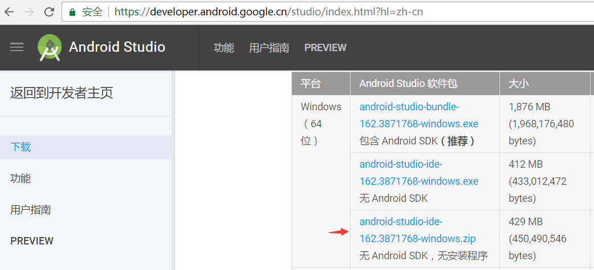

<!DOCTYPE html>
<html>
<head>
<meta charset="UTF-8">
</head>
<body>

Android Studio作为Google官方推荐开发工具，随着Android系统不断更新，可以预见会逐步替代Eclipse成为Android Application的主要开发工具。

<h5>
<a href="https://developer.android.google.cn/index.html?hl=zh-cn" style="text-decoration: none;">官方下载地址及安装方式</a>
</h5>
1.Android Studio在windows下有包含SDK和不包含SDK的安装方式，及无SDK的无安装压缩版。 
 
2.下载后解压到任何目录下即可，依次进入android-studio > bin > 运行studio64.exe 
3.初次运行会提示是否使用既有配置、是否使用代理、是否连网下载android tools及platforms等相关选项，根据自己的系统环境自主选择。

<h5>配置</h5>
1.Android Studio安装好后进入到欢迎界面，常用功能包括创建新项目，打开已有gradle项目，从版本管理中导出项目，导入Eclipse项目。 
2.可以在欢迎页面中设置相关功能，包括IDE及项目的相关设置。 
3.相关的配置及环境存放位置，as IDE集成了jre及相关plugins（...android-studio\jre|plugins），默认安装好后是可以直接新建及运行项目的。
SDK会下载到默认路径或配置的SDK路径下，可以在configure>settings>Appearance & behavior>system settings>android sdk修改。 
4.Android Studio默认配置路径${user.home}（C:\Users\xx）。 
5.配置相关的文件和AndroidStudioProjects存放在同一目录下，.android（存放keystore等），.AndroidStudio2.3（IDE配置存档），.gradle（gradle工具）。 
6. .AndroidStudio xx路径修改，进入Android Studio的安装目录，进入bin文件夹，用文本编辑软件打开idea.properties，去掉以下两项的注释符号#，修改对应的路径为新路径即可。 
7. .gradle路径修改，File>Settings>Build,Execution,Deployment>Gradle>Service directory path。 
8.<a href="https://services.gradle.org/distributions/">Gradle Build Tool</a>，.gradle下载地址。Gradle覆盖为${user.home}\.gradle\wrapper\dists\gradle-xxx-all\xxxxxxxxxx。 
9.Version Control配置，File>Settings>Appearance & Behavior>Subversion>Git|Subversion|GitHub。

<h5>Project</h5>
1.File>New下面可以进行新建、导入、版本管理获取项目，也可以新建、导入Module（功能与ADT library相同）。 
2.File>open Recent下面可以打开其他的as项目。 
3.File>close project关闭当前项目返回到欢迎界面。 
4.File>settings下面执行IDE及项目的相关设置。 
5.File>Project Structure里进行设置。设置项包括sdk、jdk、ndk Location，gradle、plugin Version，plugin、library Repository。
Modules下可以选择设置app及plugin的build.gradle，包括编译版本，测试版本及相关引用等设置。 

<h5>快捷键</h5>
1.代码提示补全快捷键ctrl+alt+space。 
2.导包快捷键alt+enter。 
3.生成set和get方法，重写父类方法快捷键alt+insert。 
4.删除行，ctrl+y。

<h5>开发技巧</h5>
1.jcenter库中为项目自动下载添加库，比如：向项目中添加gson解析功能，as>File>Project Structure>Modules>Dependencies>+ Library dependency>Choose Library Dependency>search gson>add ok>自动下载添加build.gradle\dependencies\compile'gson pkg'>自动引用到External Libraries。
如果知道包名，可以在dependencies中直接添加compile，IDE会提示是否同步sync now，同意后也会自动下载，比如添加compile 'com.tencent.mm.opensdk:wechat-sdk-android-with-mta:+'。

</body>
</html>
